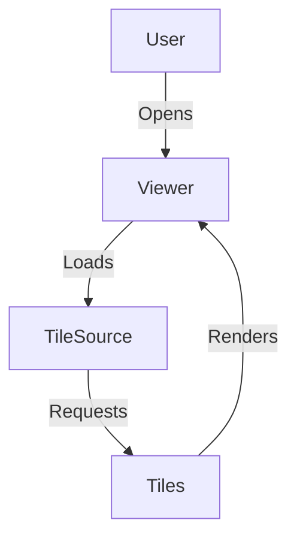

# Documentation Standards

## Overview

Comprehensive standards and guidelines for creating, maintaining, and organizing documentation for the OpenSeadragon website. These standards ensure consistency, quality, and ease of contribution across all documentation.

## Documentation Types

### 1. API Documentation
Documentation for the OpenSeadragon JavaScript API.

### 2. Guides & Tutorials
Step-by-step instructions for common tasks and use cases.

### 3. Examples
Interactive code examples demonstrating specific features.

### 4. Reference Materials
Technical specifications, configuration options, and reference tables.

### 5. Contributing Guides
Documentation for contributors and maintainers.

## Markdown Conventions

### File Naming

#### Rules
- Use lowercase kebab-case: `getting-started.md`, `api-reference.md`
- Be descriptive but concise: `viewport-navigation.md` not `nav.md`
- Use numbers for ordered content: `01-setup.md`, `02-configuration.md`
- Avoid special characters except hyphens

#### Examples
```
✅ Good:
- getting-started.md
- viewport-navigation.md
- custom-tile-sources.md
- 01-installation.md

❌ Bad:
- GettingStarted.md
- viewport_navigation.md
- custom tile sources.md
- 1.md
```

### Front Matter

#### Required Fields
```yaml
---
title: Page Title  # Required: Page title (50 chars max)
description: Brief description  # Required: Meta description (160 chars max)
category: guide  # Required: guide|api|example|reference
tags: [navigation, viewport, beginner]  # Optional: Content tags
author: John Doe  # Optional: Original author
lastUpdated: 2025-10-23  # Auto-generated
version: 3.0.0  # Optional: OSD version
difficulty: beginner  # Optional: beginner|intermediate|advanced
---
```

#### Example Front Matter
```yaml
---
title: Getting Started with OpenSeadragon
description: Learn how to install and configure OpenSeadragon for your first deep zoom image viewer.
category: guide
tags: [installation, setup, beginner, quickstart]
difficulty: beginner
version: 3.0.0
---
```

### Heading Structure

#### Rules
- One H1 per document (title)
- Use sequential heading levels (don't skip)
- Keep headings concise and descriptive
- Use sentence case, not title case
- No punctuation at end of headings

#### Example Structure
```markdown
# Getting Started  # H1 - Main title (only one)

## Installation  # H2 - Main sections

### Via npm  # H3 - Subsections

#### TypeScript setup  # H4 - Detailed subsections

##### Advanced configuration  # H5 - Use sparingly
```

#### Accessibility
```markdown
<!-- ✅ Good: Proper hierarchy -->
# Main Title
## Section
### Subsection
#### Detail

<!-- ❌ Bad: Skipped levels -->
# Main Title
### Subsection (skipped H2)
```

### Content Formatting

#### Code Blocks

**Always specify language:**
```markdown
```javascript
const viewer = OpenSeadragon({
  id: "viewer",
  prefixUrl: "/images/"
});
\```
```

**Supported languages:**
- `javascript` / `js`
- `typescript` / `ts`
- `html`
- `css`
- `json`
- `bash` / `shell`
- `yaml`
- `markdown`

**Add filename for context:**
````markdown
```javascript [index.js]
// Your code here
```
````

**Highlight specific lines:**
````markdown
```javascript {2-3}
const viewer = OpenSeadragon({
  id: "viewer",  // highlighted
  prefixUrl: "/images/"  // highlighted
});
```
````

#### Inline Code

```markdown
Use `backticks` for inline code, function names like `viewer.open()`, 
variable names like `prefixUrl`, and file names like `package.json`.
```

#### Links

**Internal links (relative):**
```markdown
See the [API Reference](/docs/api-reference) for details.
Check out the [installation guide](./installation.md).
```

**External links:**
```markdown
[OpenSeadragon GitHub](https://github.com/openseadragon/openseadragon)
```

**Links with titles:**
```markdown
[API Docs](/docs/api "OpenSeadragon API Documentation")
```

#### Images

**Format:**
```markdown

```

**Best practices:**
```markdown
<!-- ✅ Good: Descriptive alt text -->


<!-- ❌ Bad: Generic alt text -->

```

**Image sizing (if needed):**
```markdown
{width="600"}
```

#### Lists

**Unordered lists:**
```markdown
- First item
- Second item
  - Nested item
  - Another nested item
- Third item
```

**Ordered lists:**
```markdown
1. First step
2. Second step
   1. Substep a
   2. Substep b
3. Third step
```

**Task lists:**
```markdown
- [x] Completed task
- [ ] Pending task
- [ ] Another pending task
```

#### Tables

```markdown
| Column 1 | Column 2 | Column 3 |
|----------|----------|----------|
| Data 1   | Data 2   | Data 3   |
| Data 4   | Data 5   | Data 6   |

<!-- Alignment -->
| Left | Center | Right |
|:-----|:------:|------:|
| L1   | C1     | R1    |
```

#### Callouts/Alerts

```markdown
::alert{type="info"}
This is an informational message.
::

::alert{type="warning"}
**Warning:** This action cannot be undone.
::

::alert{type="danger"}
**Error:** Required configuration is missing.
::

::alert{type="success"}
**Success:** Installation completed.
::

::alert{type="tip"}
**Tip:** Use keyboard shortcuts for faster navigation.
::
```

#### Code Groups/Tabs

````markdown
::code-group
```bash [npm]
npm install openseadragon
```

```bash [yarn]
yarn add openseadragon
```

```bash [pnpm]
pnpm add openseadragon
```

```bash [bun]
bun add openseadragon
```
::
````

## API Documentation Standards

### API Reference Format

#### Function Documentation
```markdown
## viewer.open()

Opens a new image or image set in the viewer.

### Syntax

\```javascript
viewer.open(options)
\```

### Parameters

| Parameter | Type | Required | Default | Description |
|-----------|------|----------|---------|-------------|
| `options` | Object | Yes | - | Configuration object |
| `options.url` | String | No | - | URL to the image |
| `options.tileSources` | Array\|Object | No | - | Tile source configuration |
| `options.index` | Number | No | 0 | Starting index for image sequences |

### Returns

- **Type:** `Viewer`
- **Description:** Returns the viewer instance for chaining.

### Example

\```javascript
viewer.open({
  tileSources: '/path/to/image.dzi',
  index: 0
});
\```

### Events

This method triggers the following events:
- `open` - Fired when the image starts loading
- `open-failed` - Fired if the image fails to load

### See Also

- [viewer.close()](#viewer-close)
- [TileSources Guide](/docs/tile-sources)
```

#### Property Documentation
```markdown
## viewer.viewport

The viewport object managing the visible area and zoom level.

### Type

`Viewport`

### Read Only

Yes

### Description

The viewport manages all aspects of what portion of the image is visible,
including zoom level, pan position, and rotation.

### Example

\```javascript
const bounds = viewer.viewport.getBounds();
console.log('Current zoom:', viewer.viewport.getZoom());
\```

### Properties

| Property | Type | Description |
|----------|------|-------------|
| `viewer` | Viewer | Reference to parent viewer |
| `contentSize` | Point | Size of the content |
| `contentAspectRatio` | Number | Aspect ratio of content |

### Methods

- [viewport.getZoom()](#viewport-getzoom)
- [viewport.setZoom()](#viewport-setzoom)
- [viewport.getBounds()](#viewport-getbounds)
```

#### Event Documentation
```markdown
## Events: open

Fired when an image begins to load.

### Event Data

| Property | Type | Description |
|----------|------|-------------|
| `source` | TileSource | The tile source being opened |
| `eventSource` | Viewer | The viewer instance |

### Example

\```javascript
viewer.addHandler('open', function(event) {
  console.log('Image opened:', event.source);
});
\```

### See Also

- [open-failed event](#events-open-failed)
- [viewer.open()](#viewer-open)
```

### TypeScript Definitions

Include TypeScript type definitions in documentation:

```markdown
### TypeScript

\```typescript
interface OpenOptions {
  url?: string;
  tileSources?: string | object | Array<string | object>;
  index?: number;
  opacity?: number;
  x?: number;
  y?: number;
  width?: number;
  height?: number;
  degrees?: number;
}

viewer.open(options: OpenOptions): Viewer;
\```
```

## Code Example Standards

### Example Structure

#### Minimal Example
```markdown
## Basic Viewer

\```javascript
// Create a basic viewer
const viewer = OpenSeadragon({
  id: "viewer",
  prefixUrl: "/openseadragon/images/",
  tileSources: "/path/to/image.dzi"
});
\```
```

#### Complete Example
```markdown
## Complete Example: Custom Navigation Controls

This example demonstrates how to implement custom navigation controls
with keyboard shortcuts.

### HTML

\```html [index.html]
<!DOCTYPE html>
<html>
<head>
  <title>Custom Navigation</title>
  <style>
    #viewer {
      width: 800px;
      height: 600px;
    }
  </style>
</head>
<body>
  <div id="viewer"></div>
  <script src="openseadragon.min.js"></script>
  <script src="custom-nav.js"></script>
</body>
</html>
\```

### JavaScript

\```javascript [custom-nav.js]
const viewer = OpenSeadragon({
  id: "viewer",
  prefixUrl: "/images/",
  tileSources: "/path/to/image.dzi",
  // Disable default navigation
  showNavigationControl: false,
  gestureSettingsMouse: {
    clickToZoom: false
  }
});

// Custom zoom in
document.getElementById('zoom-in').addEventListener('click', () => {
  viewer.viewport.zoomBy(1.2);
});

// Custom zoom out
document.getElementById('zoom-out').addEventListener('click', () => {
  viewer.viewport.zoomBy(0.8);
});

// Keyboard shortcuts
document.addEventListener('keydown', (e) => {
  switch(e.key) {
    case '+':
      viewer.viewport.zoomBy(1.2);
      break;
    case '-':
      viewer.viewport.zoomBy(0.8);
      break;
    case 'h':
      viewer.viewport.goHome();
      break;
  }
});
\```

### Try it

::live-demo
[Interactive demo would be embedded here]
::

### Key Concepts

- Disabling default controls
- Custom event handlers
- Viewport manipulation
- Keyboard shortcuts

### Related Examples

- [Touch Gestures](/examples/touch-gestures)
- [Pan and Zoom](/examples/pan-zoom)
```

### Interactive Demos

```markdown
## Live Demo

::playground
\```javascript
const viewer = OpenSeadragon({
  id: "viewer",
  prefixUrl: "/images/",
  tileSources: {
    Image: {
      xmlns: "http://schemas.microsoft.com/deepzoom/2008",
      Url: "/dzimages/example_files/",
      Format: "jpg",
      Overlap: "1",
      TileSize: "256",
      Size: {
        Width: "3000",
        Height: "2000"
      }
    }
  }
});
\```
::

Try modifying the code above to:
- Change the tile size
- Adjust the overlap
- Add event handlers
```

## Writing Style Guide

### Voice and Tone

**Principles:**
- **Clear and Concise**: Get to the point quickly
- **Friendly but Professional**: Approachable yet authoritative
- **Active Voice**: "Click the button" not "The button should be clicked"
- **Present Tense**: "The viewer loads" not "The viewer will load"
- **Second Person**: Use "you" when addressing the reader

**Examples:**
```markdown
✅ Good: "You can configure the viewer by passing an options object."
❌ Bad: "The viewer can be configured by passing an options object."

✅ Good: "This method returns the current zoom level."
❌ Bad: "This method will return the current zoom level."

✅ Good: "Add the script tag to your HTML file."
❌ Bad: "The script tag should be added to the HTML file."
```

### Technical Writing Best Practices

#### Be Specific
```markdown
✅ Good: "Install OpenSeadragon using npm: npm install openseadragon"
❌ Bad: "Install OpenSeadragon using a package manager"
```

#### Use Examples
```markdown
✅ Good: 
"The prefixUrl option specifies where UI images are located.

\```javascript
const viewer = OpenSeadragon({
  prefixUrl: '/openseadragon/images/'
});
\```"

❌ Bad: "The prefixUrl option specifies where UI images are located."
```

#### Explain Why
```markdown
✅ Good: 
"Set `immediateRender: true` to display the image instantly. This improves 
perceived performance but may show lower quality tiles initially."

❌ Bad: "Set `immediateRender: true`."
```

#### Define Technical Terms
```markdown
✅ Good:
"OpenSeadragon uses Deep Zoom Images (DZI), a format that divides images
into small tiles for efficient loading."

❌ Bad: "OpenSeadragon uses DZI format."
```

### Common Phrases

**Instructions:**
- "To [action], [do this]"
- "Follow these steps to..."
- "Complete the following:"

**References:**
- "See [link] for more details"
- "Learn more about [topic] in the [guide]"
- "For a complete list, refer to [reference]"

**Notes:**
- "Note: [important information]"
- "Important: [critical information]"
- "Tip: [helpful suggestion]"
- "Warning: [caution]"

## Version Documentation

### Versioning Content

#### Version Tags
```yaml
---
title: Feature Name
version: 3.0.0  # Version when feature was introduced
deprecated: 4.0.0  # Version when deprecated (if applicable)
removed: 5.0.0  # Version when removed (if applicable)
---
```

#### Version Notices
```markdown
::alert{type="info"}
**Since version 3.0.0**
::

::alert{type="warning"}
**Deprecated in 4.0.0**: Use [newMethod](#new-method) instead.
::

::alert{type="danger"}
**Removed in 5.0.0**: This feature has been removed. See [migration guide](/docs/migration-v5).
::
```

### Changelog Format

```markdown
# Changelog

## Version 3.0.0 (2025-10-23)

### Added
- New viewport rotation feature
- Touch gesture improvements
- WebGL rendering support

### Changed
- Updated tile loading algorithm
- Improved memory management
- Enhanced mobile performance

### Deprecated
- `oldMethod()` - Use `newMethod()` instead
- Legacy tile source format

### Removed
- Support for IE11
- Deprecated v2.x methods

### Fixed
- Fixed zoom calculation bug
- Corrected event timing issues
- Resolved memory leak in tile cache

### Security
- Updated dependencies
- Fixed XSS vulnerability in overlay rendering
```

## Screenshot and Asset Guidelines

### Screenshots

#### Requirements
- **Format**: PNG for UI, WebP for photos
- **Dimensions**: 
  - Full viewport: 1200x800px
  - Detail shots: 800x600px
  - Mobile: 375x812px (iPhone X)
- **DPI**: 72 DPI for web
- **File Size**: <200KB per image
- **Compression**: Use ImageOptim or similar

#### Naming Convention
```
{feature}-{variant}-{size}.{ext}

Examples:
- viewer-basic-large.png
- navigation-controls-mobile.png
- overlay-example-detail.png
```

#### Alt Text
```markdown


✅ Good: "OpenSeadragon viewer displaying a zoomed manuscript with visible navigation controls"
❌ Bad: "Screenshot" or "Image 1"
```

### Diagrams

#### Format
- Use Mermaid for diagrams in markdown
- SVG for complex illustrations
- Export at 2x resolution for retina displays

#### Example Diagram
````markdown

````

### Icons and Graphics

- **Format**: SVG preferred
- **Size**: Optimize/minify SVGs
- **Accessibility**: Include `title` and `desc` elements
- **Colors**: Use theme-aware colors

## Content Organization

### Directory Structure

```
content/
├── docs/
│   ├── index.md                 # Documentation home
│   ├── getting-started/
│   │   ├── index.md
│   │   ├── installation.md
│   │   └── quick-start.md
│   ├── guides/
│   │   ├── index.md
│   │   ├── viewport-navigation.md
│   │   └── custom-tile-sources.md
│   ├── api/
│   │   ├── index.md
│   │   ├── viewer.md
│   │   ├── viewport.md
│   │   └── tile-source.md
│   └── migration/
│       ├── v2-to-v3.md
│       └── v3-to-v4.md
├── examples/
│   ├── index.md
│   ├── basic/
│   │   ├── simple-viewer.md
│   │   └── multiple-images.md
│   └── advanced/
│       ├── custom-controls.md
│       └── overlay-annotations.md
└── blog/
    ├── 2025-01-15-new-release.md
    └── 2025-02-01-performance-tips.md
```

### Navigation Hierarchy

```yaml
# content/docs/_navigation.yml
- title: Getting Started
  children:
    - Installation
    - Quick Start
    - Configuration
    
- title: Guides
  children:
    - Viewport Navigation
    - Tile Sources
    - Events and Callbacks
    - Overlay and Annotations
    
- title: API Reference
  children:
    - Viewer
    - Viewport
    - TileSource
    - Events
```

## Contributor Guidelines

### Documentation Contributions

#### Before Writing
- [ ] Check existing documentation for duplicates
- [ ] Review the style guide
- [ ] Understand the target audience
- [ ] Plan the content structure

#### While Writing
- [ ] Follow markdown conventions
- [ ] Use appropriate heading levels
- [ ] Include code examples
- [ ] Add screenshots if helpful
- [ ] Test all code examples
- [ ] Proofread for clarity

#### Before Submitting
- [ ] Run markdown linter
- [ ] Check all links
- [ ] Test code examples
- [ ] Add appropriate front matter
- [ ] Review for accessibility
- [ ] Spellcheck

### Documentation Review Checklist

**Content Quality:**
- [ ] Information is accurate and up-to-date
- [ ] Examples work as expected
- [ ] Terminology is consistent
- [ ] No broken links
- [ ] Images have alt text

**Technical Accuracy:**
- [ ] Code examples are tested
- [ ] API signatures are correct
- [ ] Version information is accurate
- [ ] TypeScript types are correct

**Style Compliance:**
- [ ] Follows markdown conventions
- [ ] Proper heading hierarchy
- [ ] Consistent formatting
- [ ] Clear and concise writing
- [ ] Appropriate code highlighting

## Quality Metrics

### Documentation Health
- **Coverage**: % of API covered by docs
- **Freshness**: Last update date for each page
- **Link Health**: % of working links
- **Example Quality**: % of tested examples
- **Search Findability**: % of docs appearing in search

### Monitoring
```yaml
# .github/workflows/docs-health.yml
- Check for broken links
- Validate code examples
- Check markdown formatting
- Verify image optimization
- Run accessibility tests
```

## Tools and Resources

### Recommended Tools
- **Markdown Editor**: VS Code with Markdown extensions
- **Linting**: markdownlint
- **Link Checking**: markdown-link-check
- **Screenshot Tool**: Flameshot (Linux), ShareX (Windows)
- **Image Optimization**: ImageOptim, Squoosh
- **Diagram Tool**: Mermaid, Excalidraw

### VS Code Extensions
- Markdown All in One
- Markdown Lint
- Markdown Preview Enhanced
- Code Spell Checker
- Better Comments

### Useful Resources
- [CommonMark Spec](https://commonmark.org/)
- [GitHub Flavored Markdown](https://github.github.com/gfm/)
- [Google Developer Documentation Style Guide](https://developers.google.com/style)
- [Microsoft Writing Style Guide](https://docs.microsoft.com/en-us/style-guide/)
